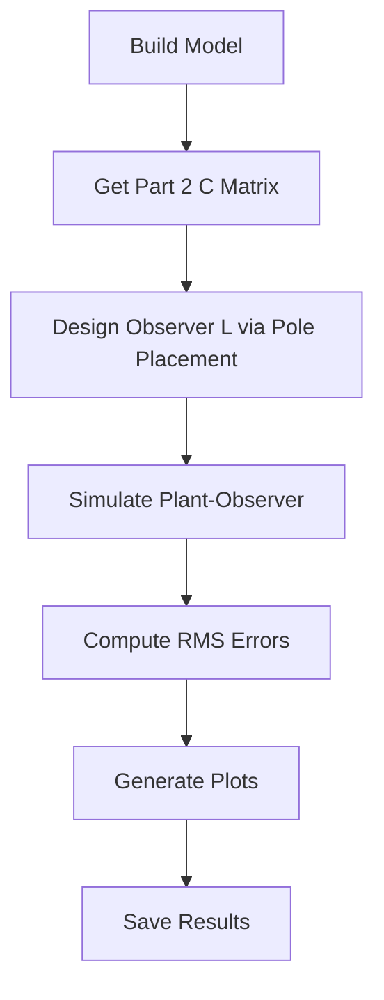

# Part 2: Observer Design - Simplified Implementation

## Overview

Part 2 designs a Luenberger observer for the 6-mass spring system using an augmented sensor matrix (measuring x1 and x6). The simplified code will maintain the core algorithm while removing excessive validation and using shared utility functions.

## Key Components from Original

**Source files:**

- [`python/part2/observer_design.py`](python/part2/observer_design.py) - Observer design functions (574 lines)
- [`python/part2/run_observer_sim.py`](python/part2/run_observer_sim.py) - Simulation script (436 lines)

**Core algorithm to preserve:**

1. Part 2 C matrix (2x12): measures x1 and x6
2. Part 2 initial conditions: x0 = [0,0,0,1,1,1,0,0,0,0,0,0], xhat0 = [0,0,0,0,0,1,0,0,0,0,0,0]
3. Pole placement observer design via dual system (A^T, C^T)
4. Plant-observer coupled simulation
5. RMS error computation

## Simplification Strategy

### 1. Add Utils Functions to [`final/utils/simulation.py`](final/utils/simulation.py)

Add a `simulate_observer` function for plant-observer simulation:

```python
def simulate_observer(Ad, Bd, Cd, L, x0, xhat0, u, Ts=None):
    """Simulate plant-observer system: x_true vs x_estimated."""
```

### 2. Create Simplified [`final/part2/observer_design.py`](final/part2/observer_design.py)

Target: ~100-120 lines (down from 1000+ combined)

**Structure:**

```python
import numpy as np
from scipy.signal import place_poles
from final.utils.model import build_continuous_model, discretize_zoh
from final.utils.simulation import simulate_observer
from final.utils.plotting import plot_signals

def get_part2_C():
    """Part 2 sensor matrix measuring x1 and x6."""

def get_part2_initial_conditions():
    """Part 2 initial conditions."""

def design_observer_gain(Ad, Cd, pole_range=(0.4, 0.8)):
    """Design observer gain L using pole placement via dual system."""

def main():
    # 1. Build model
    # 2. Get Part 2 C matrix and ICs
    # 3. Design observer
    # 4. Simulate
    # 5. Plot and save results
```

**Key simplifications:**

- Remove redundant controllability checks (trust observability from Part 1)
- Remove balancing transformation code (rarely used, adds complexity)
- Remove dual LQR fallback (pole placement works for this system)
- Remove verbose logging and intermediate validations
- Keep only essential design info for report

### 3. Expected Outputs in `final/part2/outputs/`

- `outputs_comparison.png` - y vs yhat for both measured outputs
- `estimation_errors.png` - Estimation errors for displacements (x1-x6)
- `results.txt` - Observer gain, spectral radius, RMS errors

### 4. Create [`final/part2/part2_report.md`](final/part2/part2_report.md)

**Content:**

- Objective: Observer design with two sensors
- Approach: Pole placement via dual system, poles in [0.4, 0.8]
- Key results: Observer gain L (12x2), spectral radius, convergence
- Findings: Observer successfully estimates all 12 states



## Key Design Decisions

1. **Observer design method**: Use pole placement with 12 distinct real poles evenly spaced in [0.4, 0.8]
2. **Simulation**: Zero input (open-loop), N=1000 steps, Ts=0.01
3. **Metrics**: RMS errors for displacements, spectral radius verification

## Validation Checklist

- Observer spectral radius < 1.0 (stable)
- Estimation errors converge to near-zero
- Match key numerical results from original (spectral radius = 0.8, final error ~1e-9)