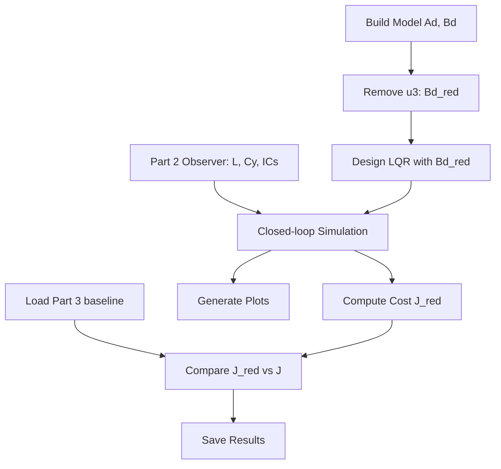

# Part 4: Reduced Input LQR Implementation

## Summary

Part 4 redesigns the LQR controller with only two inputs (u1, u2), removing u3 from the B matrix. The implementation will be simplified from the original 1100-line `python/part4/run_lqr_reduced_input.py` to approximately 100-150 lines following the anchor guidelines.

## Architecture



## Key Changes from Part 3

| Aspect | Part 3 | Part 4 |

|--------|--------|--------|

| Input matrix | Bd (12x3) | Bd_red = Bd[:, [0,1]] (12x2) |

| LQR gain | K (3x12) | K_red (2x12) |

| R matrix | I_3 (3x3) | I_2 (2x2) |

| Simulation | `simulate_lqr_with_observer` | New: `simulate_lqr_reduced` |

## Implementation Plan

### 1. Add Utility Function to `final/utils/simulation.py`

Add `simulate_lqr_reduced(Ad, Bd_red, Cd, K_red, L, x0, xhat0, N, Ts)` at the end of the file. This is a minor modification of `simulate_lqr_with_observer` to handle 2-input systems.

### 2. Create `final/part4/lqr_reduced.py`

Simplified structure (~100 lines):

```python
"""Part 4: LQR Controller with Reduced Inputs (u3 Removed)"""

def main():
    # 1. Build model and create Bd_red = Bd[:, [0, 1]]
    # 2. Load Part 2 dependencies (Cy, L, x0, xhat0)
    # 3. Define Q = Cy.T @ Cy, R_red = I_2
    # 4. Design LQR with (Ad, Bd_red, Q, R_red)
    # 5. Simulate closed-loop with observer
    # 6. Compute cost and compare with Part 3
    # 7. Generate plots and save results
```

### 3. Generate Outputs in `final/part4/outputs/`

- `outputs_y1_y6.png` - Output displacements
- `inputs_u1_u2.png` - Two control inputs (full window)
- `estimation_error_norm.png` - Observer error convergence
- `results.txt` - Summary with Part 3 comparison
- `K_red_matrix.npy` - LQR gain for reproducibility
- `traj.npz` - Trajectories for later parts

### 4. Create `final/part4/part4_report.md`

Concise report with:

- Objective: LQR with reduced inputs
- Approach: Remove u3, redesign controller
- Key results: K_red, spectral radius, cost comparison
- Findings: Impact of removing one input

## Files to Modify/Create

| File | Action |

|------|--------|

| [`final/utils/simulation.py`](final/utils/simulation.py) | Add `simulate_lqr_reduced` function |

| [`final/part4/lqr_reduced.py`](final/part4/lqr_reduced.py) | Create simplified implementation |

| `final/part4/part4_report.md` | Create report |

| `final/part4/outputs/` | Generate all output files |

## Reuse Strategy

- **Model**: `build_continuous_model()`, `discretize_zoh()` from `final/utils/model.py`
- **Part 2**: `get_part2_C()`, `get_part2_initial_conditions()`, `design_observer_gain()` from `final/part2/observer_design.py`
- **Part 3**: `design_lqr()`, `compute_cost()` logic (can reuse or inline)
- **Part 3 baseline**: Load from `final/part3/outputs/results.txt` for comparison